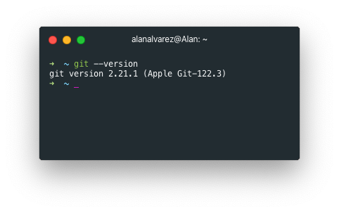
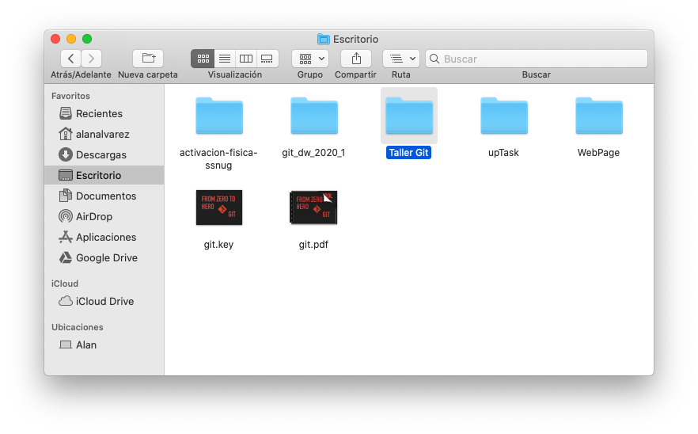

# Git: From Zero to Hero

Bienvenido a este taller de la *DevWeek Ene-Jun 2020*, por parte de *BeeDevelopers*, en donde te enseñarémos como usar el sistema de control de versiones mas popular hoy en día: *Git*. De igual manera, te mostraemos *GitHub* y los repositorios remotos.


---

## Descargas, instlación y confirguación

### Aquí podras descargar un pdf con un listado completo de comandos de Git proporcionado por GitHub

[link](https://github.github.com/training-kit/downloads/es_ES/github-git-cheat-sheet.pdf)

### Descargar Git

Antes de descargar git, deberás comprobar si tu computadora no posee ya alguna versión de git. Es posible que sistemas operativos como **Linux** o **MacOS** tengan pre-instalado git.

Para comprobar si posees alguna versión de git ejecuta el siguiente comando en la terminal de tu sistema opertaivo.

```bash
git --version
```

Deberás obtener una respuesta como esta:



Si no tienes git instalado da click [aquí](https://git-scm.com/downloads) y descarga la versión correcta para tu sistema operativo. Será de gran ayuda tener un editor de texto como **Visual Studio Code** o el que sea de tu preferencia, para descargarlo da click [aquí](https://code.visualstudio.com).

Una vez terminado el proceso de instalación necesitas ejecutar el comando antes mencionado para comprobar que se ha instalado correctamente.

### Confirguración básica

Debemos confirgurar nuestro nombre de ususuario y correo electrónico para comenzar a usar git. 

Ejecuta el siguiente comando para confirgurar tu nombre:

```bash
git config --global user.name "Tu nombre"
```

Enseguida, ejecuta el siguiente comando para configurar tu email:

```bash
git config --global user.email correo@ejemplo.com
```

Para comprobar que los cambios se hayan efectuado, ejecutamos el siguiente comando:

```bash
git config --list
```

### Crea tu cuenta en Github

Todavía no es momento de empezar a trabajar con **GitHub**. Sin embargo, para agilizar este taller te recomendamos acceder a este [url](https://github.com) y comenzar a crear tu cuenta en **GitHub**, es gratis y procura usar el mismo email que empleaste en la configuración básica de *git*.

---

## Tu primer repositorio

Ve al escritorio de tu sistema operativo y crea una nueva carpeta, nombrala *Taller Git*. 



Deberás acceder al interior de tu carpeta desde la terminal o ventana de comandos. Si no estas seguro de cómo hacerlo, no te preocupes nosotros te apoyaremos. 

Una vez dentro de tu carpeta *Taller Git*, desde la línea de comando o terminal, ejecuta el siguiente comando:

```bash
git init
```

¿Qué hace *git init*? Este comando se emplea para indicar que el directorio donde nos encontramos comenzará a trabajar como un repositorio. Crea, dentro del mismo, un subdirectorio llamado *.git* que contiene todo lo necesario para que git comience a trabajar. También creará la rama **master** de nuestro proyecto.

## Operaciones de Git

### Add
Si haces un cambio en algún documento es necesario decirle a *Git* que quieres que se sincronice con el reporitorio. *Git* no lo hace automáticamente así que debes de escribir el comando:

```bash
git add .
```
El `.` hace referencia a todos los archivos de la carpeta y esta es la opción que usarás casi todas las veces. Si quisieras sólo agregar un archivo para que se sincronice entonces cambia el punto `.` por el nombre de un archivo.

### Commit
Ya que has hecho tus cambios y quieres que se sincronicen en el repositorio se debe hacer un **commit**. En un **commit** se guardan los cambios a uno o varios archivos y es, por asi decirlo , *una nueva versión de tu programa*. Todos los commit deben de llevar un mensaje. Trata de ser específico y mencionar todos los cambios que hiciste para que si luego quieres deshacer cambios y volver a una versión antigua de tu programa sepas exactamente qué hiciste en esa versión.
El comando es:
```bash
git commit -m "aqui va tu mensaje"
```

### Status
Como se puede intuir por el nombre, *git status* nos muestra el estado de nuestro repositorio. Esto quiere decir que nos muestra si falta algún archivo por añadir al repositorio, si hay algún conflicto entre archivos, etc.
El comando para ver el estado es:
```bash
git status
```

### Checkout

Las *ramas* se usan para desarrollar funcionalidades separadas unas de otras en tu proyecto. La rama que está por defecto en tu proyecto se le denomina **master** y es la que posee la versión final o funcional de tu proyecto. Es altamente recomendable no editar la master directamente, si quieres agregar una nueva funcionalidad a tu proyecto crea una nueva rama y hasta que no estes seguro de que todo funciona fusionas la rama creada con la master. De esta manera si estropeas algo solo basta con eliminar la rama nueva y volver a comenzar.

Para crear una nueva rama en tu repositorio y posicionarte sobre ella automaticamente se usa el siguiente comando: 
(Crearemos una rama llamada "ramona")

```bash
git checkout -b ramona
```
Para comabiar entre ramas se usa: (Cambiaremos de la rama actual a "ramona")

```bash
gir checkout ramona
```
Para eliminar una rama se utiiza el siguiente comando: (Eliminaremos a "ramona")

```bash
git branch -d ramona
```
Para fusionar otra rama en tu rama actual se utiliza el siguiente comando: (Fusionaremos a "ramona" con la rama en donde nos encontremos)

```bash
git merge ramona
```


